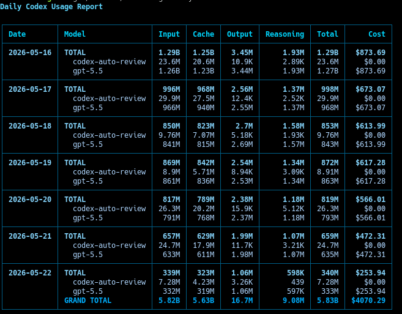
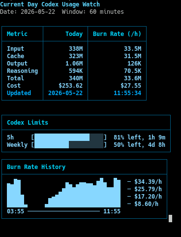

# codexusage

See how much your OpenAI Codex sessions cost - broken down by day, month, or session - right from your terminal.

Inspired by [`@ccusage/codex`](https://github.com/ryoppippi/ccusage), `codexusage` is a ground-up Rust rewrite built for users who need a significantly faster and lighter alternative to scan large session histories.

## Screenshots





## Install

```bash
cargo install codexusage
```

## Quick start

```bash
# Daily usage summary
codexusage daily

# Monthly report as JSON
codexusage monthly --json

# Last 7 days only
codexusage daily --last-days 7

# Current project only
codexusage daily --current-dir

# Custom session directory
codexusage session --session-dir /path/to/sessions
```

## Examples

Filter by date range:

```bash
codexusage daily --since 2026-03-01 --until 2026-03-31
```

Skip network and use cached pricing:

```bash
codexusage daily --offline
```

JSON output for scripts and dashboards:

```bash
codexusage daily --json
```

Limit usage to one project directory and its descendants:

```bash
codexusage daily --project-dir /path/to/project
codexusage session --current-dir
```

## Watch mode

Monitor today's usage live in your terminal. The screen refreshes automatically and shows a rolling burn rate so you can see how fast tokens are being consumed:

```bash
codexusage watch
```

Custom refresh interval (default 5 seconds):

```bash
codexusage watch --interval 10
```

Opt in to per-model burn-rate columns inside the watch table:

```bash
codexusage watch --per-model-burn-rate
```

Sample output:

```text
Current Day Codex Usage Watch
Date: 2026-03-11  Window: 60 minutes

+-----------+------------+----------------+
| Metric    | Today      | Burn Rate (/h) |
+-----------+------------+----------------+
| Input     |       450K |            56K |
| Cache     |       120K |            15K |
| Output    |        30K |             4K |
| Reasoning |        12K |             2K |
| Total     |       612K |            77K |
| Cost      |      $0.85 |          $0.11 |
| Updated   | 2026-03-11 |       14:32:23 |
+-----------+------------+----------------+

+------------------------------------+
| Burn Rate History                  |
+------------------------------------+
|         ▆                ─ $0.16/h |
|       ▆███▆              ─ $0.12/h |
|   ▂▅███████▅▃            ─ $0.08/h |
| ▁▄███████████▃▁          ─ $0.04/h |
| 10:30 ───── 14:30                  |
+------------------------------------+
```

Watch mode does not support `--json`, `--since`, `--until`, or `--last-days`.
Use `--per-model-burn-rate` to append one burn-rate column per active model, with aggregate `Burn Rate (/h)` kept as the rightmost column.
When the terminal is too narrow to fit every per-model column in one table, watch mode automatically
stacks multiple table blocks vertically, repeating the `Metric` column in each block while keeping
`Today` in the first block and aggregate `Burn Rate (/h)` in the final block.
Watch mode also refreshes Codex 5h and weekly usage-limit bars every 3 minutes from
`${CODEX_HOME:-~/.codex}/auth.json` when ChatGPT auth is available. Missing auth, expired tokens,
`--offline`, and usage API failures are shown as an unavailable limit status without stopping the
watch screen. Reset countdowns are calculated locally between usage refreshes.
When enough terminal space is available, watch mode also shows a compact cost burn-rate graph built
from trailing 30-minute windows sampled every 15 minutes. The graph uses the past 8 hours on larger
terminals and falls back to the past 4 hours on tighter screens.

## Options

Commands:

- `daily` - group usage by day
- `monthly` - group usage by month
- `session` - group usage by session
- `watch` - live current-day monitor with burn rate

Flags:

- `--json` - emit structured JSON instead of a table
- `--since` / `--until` - inclusive date filters
- `--last-days N` / `-L N` - show the last N calendar days (daily only)
- `--timezone` - IANA timezone for grouping
- `--offline` - use cached pricing, never hit the network
- `--refresh-pricing` - force a pricing refresh
- `--no-cache-cost` - treat cache-read input tokens as free in cost calculations
- `--exclude-cache-read` - subtract cache-read input tokens from reported input/total usage and hide cache-read columns
- `--session-dir` - override session directory (repeatable)
- `--project-dir PATH` - only include sessions whose logged working directory is under this project path
- `--current-dir` - shortcut for `--project-dir` with the current directory
- `--threads N` - scanner worker count
- `--number-format full` - show full token counts instead of K/M/B/T
- `watch --per-model-burn-rate` - show per-model burn-rate columns in the live watch table

`--last-days` cannot be combined with `--since` or `--until`.

By default, `codexusage` scans `CODEX_HOME/sessions` (or `~/.codex/sessions` when `CODEX_HOME` is not set).

## Sample output

```text
Daily Codex Usage Report

+------------+--------------+-------+-------+--------+-----------+-------+-------+
| Date       | Model        | Input | Cache | Output | Reasoning | Total |  Cost |
+------------+--------------+-------+-------+--------+-----------+-------+-------+
| 2026-03-01 | TOTAL        |  120K |   30K |     8K |        4K |  158K | $0.20 |
|            |   gpt-5      |  120K |   30K |     8K |        4K |  158K | $0.20 |
+------------+--------------+-------+-------+--------+-----------+-------+-------+
| 2026-03-02 | TOTAL        |   90K |   20K |     6K |        2K |  118K | $0.03 |
|            |   gpt-5-mini |   90K |   20K |     6K |        2K |  118K | $0.03 |
|            | GRAND TOTAL  |  210K |   50K |    14K |        6K |  276K | $0.23 |
+------------+--------------+-------+-------+--------+-----------+-------+-------+
```

## Pricing

Pricing data is cached locally and refreshed automatically when stale. Use `--offline` to skip network access entirely, or `--refresh-pricing` to force an update. Use `--no-cache-cost` to keep cache-read tokens in token totals while excluding their cached-input price from cost totals. Use `--exclude-cache-read` to report fresh-input usage only; it also treats cache-read input as free for cost calculations.

Live pricing refreshes use the system CA store through `reqwest`'s Rustls backend. Minimal containers or stripped-down CI images may need a CA bundle such as `ca-certificates` installed for refreshes to succeed.

## Performance

`codexusage` was built because `@ccusage/codex` became unusably slow on large session directories. The table below shows a side-by-side comparison on the same dataset.

**Test environment:** 4.4 GB across 7726 session files, Intel i7-1185G7 (8 logical CPUs).

| Tool | Wall time | Peak RSS |
| --- | ---: | ---: |
| `codexusage` | 1.82 s | 193 MB |
| `@ccusage/codex` | 5 min 36 s | 11,547 MB |

Notes:

- `@ccusage/codex` was already cached by Bun; the one-time download is not counted.
- Results reflect this specific machine and dataset, not a universal guarantee.

## Development

Build from source:

```bash
cargo build --release
```

Source builds require a working C toolchain and `cmake` because the `reqwest` TLS stack pulls in `aws-lc-rs`.

Quality commands:

```bash
just fmt
just clippy
just test
just bench
```
